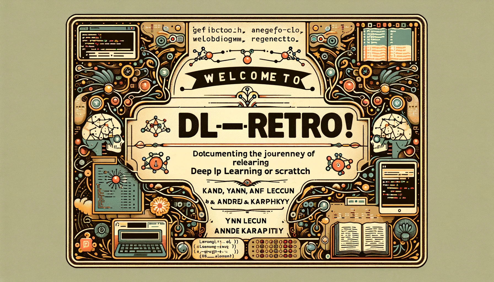

# dl-retro

Welcome to dl-retro! This repository is dedicated to documenting my journey of relearning deep learning from scratch. Following the teachings of renowned experts like Yann LeCun and Andrej Karpathy, I will be sharing my notes, code, and resources.

## Notebooks

1. [**01-tensor_in_Pytorch.ipynb**](01-tensor_in_Pytorch.ipynb): Introduction to tensors in PyTorch, covering the basics of tensor operations and manipulation.
2. [**02-LinearRegression.ipynb**](02-LinearRegression.ipynb): Implementation of linear regression from scratch, including gradient descent.
3. [**03-Classification.ipynb**](03-Classification.ipynb): Basic classification models, focusing on logistic regression and softmax classifiers.
4. [**04-Clustering.ipynb**](04-Clustering.ipynb): Introduction to clustering techniques like k-means and hierarchical clustering.
5. [**05-Anomalies_Detection.ipynb**](05-Anomalies_Detection.ipynb): Techniques for detecting anomalies in datasets, including statistical methods and autoencoders.
6. [**06-ReinforcementLearning.ipynb**](06-ReinforcementLearning.ipynb): Basics of reinforcement learning, focusing on value iteration and policy gradients.
7. [**07-MicroGrad.ipynb**](07-MicroGrad.ipynb): A from-scratch implementation of a Multi-Layer Perceptron (MLP), including foundational concepts like backpropagation and gradient descent.